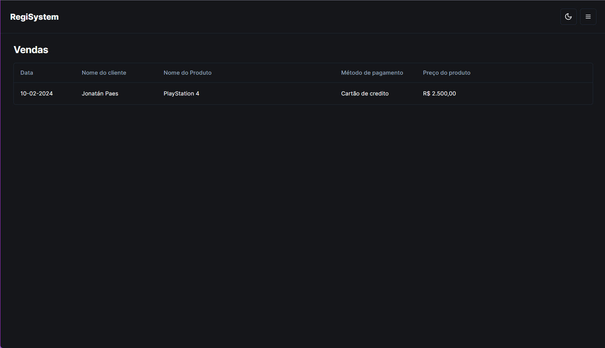

<h1 align="center">
 RegiSystem
</h1>

<p align="center">
 RegiSystem é uma aplicação para de registro de pedidos.
</p>

<p align="center">
  <a href="#como-executar">ℹ️ Como Executar?</a>&nbsp;&nbsp;&nbsp;|&nbsp;&nbsp;&nbsp;
  <a href="#web">💻 Web</a>&nbsp;&nbsp;&nbsp;|&nbsp;&nbsp;&nbsp;
  <a href="#tecnologias">🚀 Tecnologias</a>&nbsp;&nbsp;&nbsp;
</p>

---

# Como Executar?

> Clone o Repositório:

Node version 20.10.0

Clone

```bash
git clone https://github.com/JonatanPaes/regisystem.git
```

Para executar o projeto

```bash
cd regisystem
```

Instale as dependências do projeto

```bash
npm install
```


# Web
Para executar o projeto

```sh
# Executar a aplicação
npm run dev

# Para se autenticar na aplicação utilize o login
email: teste@teste.com.br
senha: 1234
```

```sh
# Executar teste 
npm run cypress
```

<p align="center">
  
</p>

# Tecnologias
- [NextJS](https://nextjs.org/)
- [TypeScript](https://github.com/microsoft/TypeScript)
- [Shadcn ui](https://ui.shadcn.com/)
- [React Hook Form](https://react-hook-form.com/)
- [Zod](https://zod.dev/)
- [Sonner](https://sonner.emilkowal.ski/)
- [TailwindCSS](https://tailwindcss.com/)
- [Lucide](https://lucide.dev/)
- [Cypress](https://www.cypress.io/)
